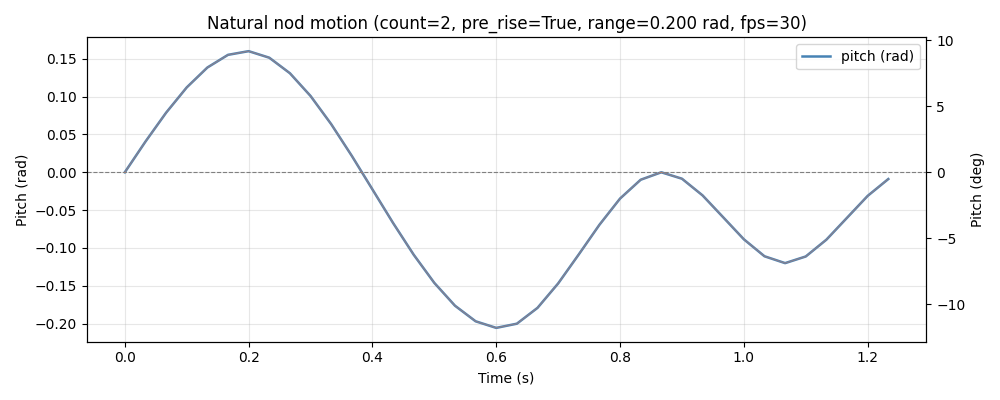

<h1>
<p align="center">
頷きパラメーター予測モデル
</p>
</h1>
<p align="center">
README: <a href="vap_nod_para.md">English </a> | <a href="vap_nod_para_JP.md">Japanese (日本語) </a>
</p>

`Maai` クラスの `mode` , `model_type`パラメータをそれぞれ `nod_para` , `normal-ver2` に設定してください。

本モデルは2チャンネルの16kHz音声データを入力とし、ch1をユーザ、ch2をシステムの音声として想定しています。

このモデルは頷きのタイミングと以下の運動学的パラメーターを予測します。

<p align="center">

| `パラメーター` | `説明` |
| --- | --- |
| range | 頷きの大きさ (rad) |
| speed | 頷きの速度 (rad/s) |
| repetitions | 頷きの回数 (1, 2, 3+) |
| swing-up | 振り上げの有無 (0, 1) |

</p>

</br>

## モーションの合成

ルールベースでパラメーターから頷きのモーションを生成するスクリプトが`src\maai\util.py`にあります。
これを用いることで以下のように頷きモーションを生成することができます。(`example\nod\nod_generate_motion.py`)




</br>

## 対応言語

現時点では日本語のみ対応しています。
`Maai` クラスの `lang` パラメータで指定してください。

### 日本語（`lang=jp`）

本モデルは以下の日本語データセットで学習されています：
- [ヒューマンロボット対話コーパス]()

</br>

## 実装例

```python
from maai import Maai, MaaiInput

mic = MaaiInput.Mic(mic_device_index=0)
zero = MaaiInput.Zero()

maai = Maai(mode="nod_para", lang="jp", frame_rate=12.5, audio_ch1=mic, audio_ch2=zero, device="cpu", model_type="normal-ver2")
maai.start()

while True:
    result = maai.get_result()

    print(result['p_nod'])
    print(result['nod_repetitions'])
    print(result['nod_repetitions_pred'])
    print(result['nod_range'])
    print(result['nod_speed'])
    print(result['nod_swing_up'])
    print(result['nod_swing_up_pred'])
```
`nod_repetitions_pred`、`nod_swing_up_pred`はそれぞれvalidation dataによる調整済みの閾値による予測です。

</br>

## パラメータ

利用可能なパラメータを以下にまとめます。
`frame_rate` はVAPモデルが1秒あたりに処理するサンプル数を指定します。
ご利用の計算環境に合わせて、この値を調整してください。

| `lang` | `frame_rate` |
| --- | --- |
| jp | 12.5 |